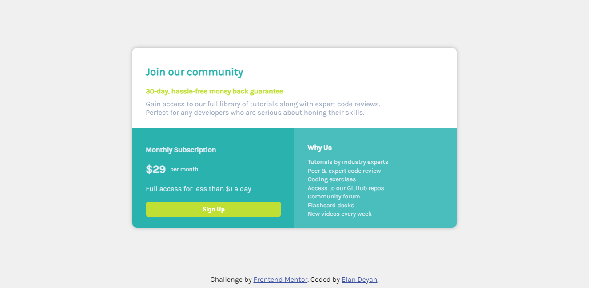

# Frontend Mentor - Single price grid component solution

This is a solution to the [Single price grid component challenge on Frontend Mentor](https://www.frontendmentor.io/challenges/single-price-grid-component-5ce41129d0ff452fec5abbbc). Frontend Mentor challenges help you improve your coding skills by building realistic projects. 

## Table of contents

- [Overview](#overview)
  - [The challenge](#the-challenge)
  - [Screenshot](#screenshot)
  - [Links](#links)
- [My process](#my-process)
  - [Built with](#built-with)
  - [What I learned](#what-i-learned)
- [Author](#author)
- [Acknowledgments](#acknowledgments)

## Overview

### The challenge

Users should be able to:

- View the optimal layout for the component depending on their device's screen size
- See a hover state on desktop for the Sign Up call-to-action

### Screenshot

### Links

- Solution URL: [Solution](https://elandeyan.github.io/front-end-mentor-challenge/)

## My process

### Built with

- Semantic HTML5 markup
- Flexbox
- CSS Grid
- Scss
### What I learned

Esse desafio me ajudou a aplicar o que vinha estudando de Scss, como organizar a estrutura da página e desenvolver um fluxo de trabalho mais organizado.

## Author

- Github - [ElanDeyan](https://github.com/ElanDeyan)
- Frontend Mentor - [@ElanDeyan](https://www.frontendmentor.io/profile/ElanDeyan)
- Instagram - [@elandeyan789](https://www.instagram.com/elandeyan789/)

## Acknowledgments

Fico muito grato por ser parte da [Iwwa](https://iwwa.com.br) e contar com o apoio, incentivo e ajuda deles.
O mesmo também da minha família <3
